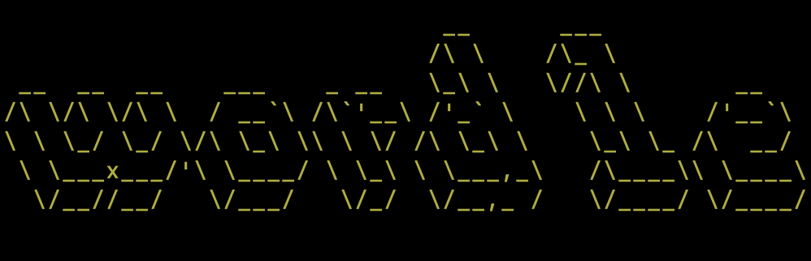
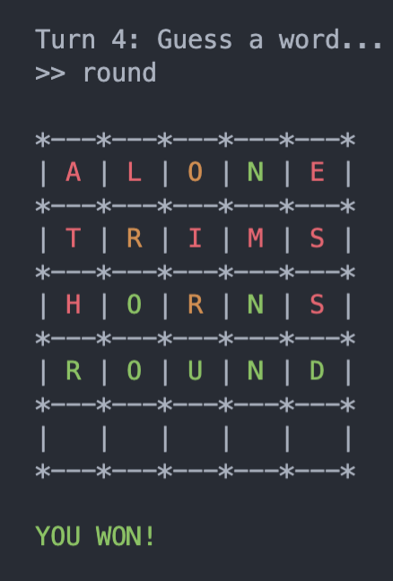

## Description

This is a simple app that lets you play Wordle on the command line! 

## Resources

- [Source Code](https://github.com/marlonmoreira000/wordle-app/tree/master/src)

## Screenshots



## How to Install and Run

1. [Install Ruby](https://www.ruby-lang.org/en/documentation/installation/) if you do not have it.
2. Clone the Wordle project from the [source code]INSERT
   
```
$ git clone https://github.com/marlonmoreira000/wordle-app.git
```

3. In your terminal, change directory into the root folder of the project repo you just cloned.

```
$ cd wordle-app
```

4. Install the Ruby gem `bundler` if you do not have it

```
$ gem install bundler
```

5. Install the required project gems 

```
$ bundle install 
```

6. Make the program executable
```
$ chmod +x run.sh
```

7. Run the app

```
$ ./run.sh
```

##  System Requirements

This app can be run on all major operating systems. See [Gemfile](https://github.com/marlonmoreira000/wordle-app/blob/master/Gemfile) for required Ruby gems.

## Techniques 

The main coding techniques used to create this app are:  

- OOP
- Ruby Modules (similar to Java Interfaces)
- Git and GitHub
- Error-handling
